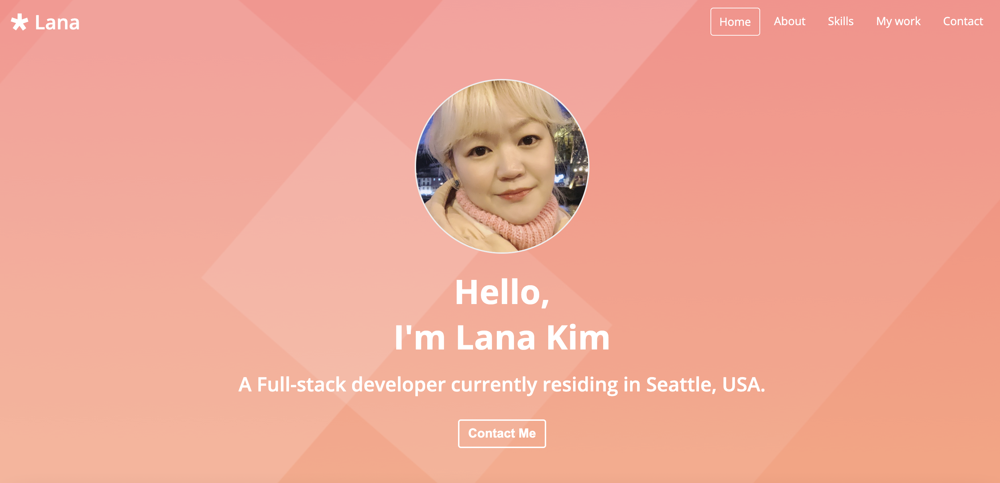

# Portfolio Update

## Table of Contents

- [ Description ](#des)
- [ Demonstration ](#demo)
- [ Deployed Link](#link)
- [ Tech Used](#tech)
- [ Questions](#q)

## Description 

This is a Portfolio of Lana Kim.

## Demonstration 

## Deployed Link 

The project is deployed to Github page and available for view :
</>

## Tech Used 

    
    
    
   

## Questions 

- create an issue : <https://github.com/lk9988/portfolio_update/issues>
